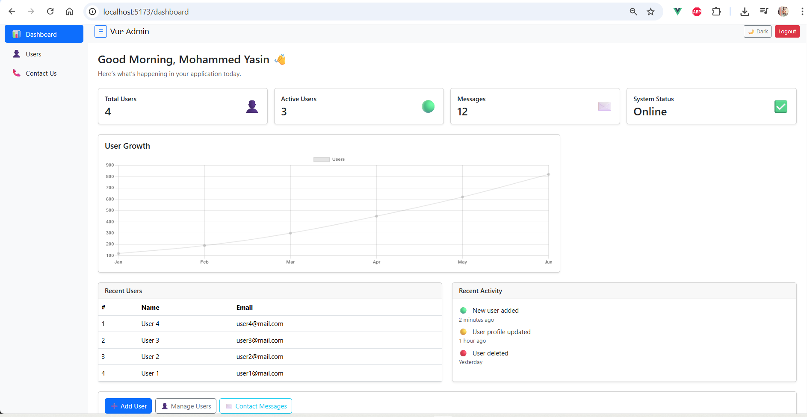

# Vue Admin Dashboard

A modern admin dashboard built with Vue 3, Pinia, Vite, Bootstrap.

### Demo Login
Admin:
username: admin
password: admin123

Viewer:
username: user
password: user123

## Features
- Authentication (Login / Logout)
- User CRUD with validation
- Pagination, Search, Sorting
- Dark / Light mode
- Responsive Sidebar
- Charts (Chart.js)
- CSV & Excel Export
- Toast notifications

## Tech Stack
- Vue 3 (Composition API)
- Pinia
- Vue Router
- Chart.js
- Bootstrap 5

## Setup
npm install
npm run dev




---

## 🛠 Tech Stack

- Vue 3 (Composition API)
- Vite
- Pinia
- Vue Router
- Bootstrap 5
- Chart.js
- SheetJS (Excel Export)

---

## 📂 Project Structure
src/
├─ components/
│ ├─ layout/
│ │ ├─ Navbar.vue
│ │ └─ Sidebar.vue
│ ├─ table/
│ │ ├─ DataTable.vue
│ │ ├─ Pagination.vue
│ │ └─ SearchBox.vue
│ ├─ users/
│ │ └─ UserForm.vue
│ ├─ dashboard/
│ │ ├─ StatsCard.vue
│ │ └─ UserGrowthChart.vue
│ └─ common/
│ └─ ExportButtons.vue
│
├─ pages/
│ ├─ Dashboard.vue
│ ├─ Users.vue
│ ├─ Contact.vue
│ └─ Login.vue
│
├─ store/
│ ├─ userStore.js
│ ├─ themeStore.js
│ ├─ uiStore.js
│ └─ toastStore.js
│
├─ utils/
│ ├─ exportCSV.js
│ └─ exportExcel.js
│
├─ router/
│ └─ index.js
│
├─ services/
│ └─ api.js
│
├─ main.js
└─ App.vue


---

## ⚙️ Installation & Setup

### Install dependencies
```bash
npm install


npm run dev


Demo Login:-
Username: any
Password: any


📊 Charts & Export

User growth visualization using Chart.js

Export users as CSV

Export users as Excel (.xlsx)

🌙 Dark Mode

Toggle from the navbar

Sidebar and content sync automatically

Theme state managed with Pinia
